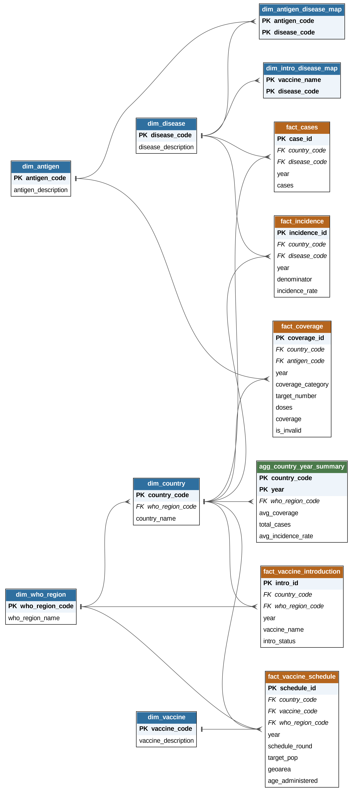

# Global Vaccination Data Analysis & Dashboard

Analyze global vaccination data to understand trends in vaccination coverage,
disease incidence, and effectiveness — cleaned and structured into a
normalized SQL database, migrated to a live cloud PostgreSQL instance, and
visualized through an interactive Streamlit dashboard.

## Pipeline overview

```
Raw WHO datasets
      │
      ▼
Vaccination_EDA.ipynb   → cleans, validates, and exports 7 cleaned CSVs
      │
      ▼
SQL.ipynb                  → builds a normalized star-schema SQL database
                              (SQLite), answers every analysis question in
                              the project brief, generates the ER diagram,
                              and exports Power BI–ready flattened tables
      │
      ▼
migration.ipynb            → migrates the SQLite database to a live,
                              always-on PostgreSQL database on Neon, with a
                              password-gated interactive query tool
      │
      ▼
streamlit_app/              → live interactive dashboard, deployed on
                              Streamlit Community Cloud, connected directly
                              to the Neon database
```

## Repository structure

```
.
├── Vaccination_EDA.ipynb        # Data cleaning & exploratory analysis
├── Vaccination_Report.docx         # Original project brief / requirements
├── cleaned_vaccine_data/           # 7 cleaned CSVs (EDA output)
│   ├── vaccination_coverage.csv
│   ├── vaccination_coverage_country_valid.csv
│   ├── incidence_rate.csv
│   ├── reported_cases.csv
│   ├── vaccine_introduction.csv
│   ├── vaccine_schedule.csv
│   └── country_year_summary.csv
├── SQL.ipynb                       # Builds the SQLite star-schema DB,
│                                    # answers all project questions,
│                                    # generates ER diagram, exports
│                                    # Power BI–ready tables
├── Migration_n_Query.ipynb                 # Migrates SQLite -> Neon PostgreSQL,
│                                    # live connection + interactive query tool
├── vaccination.db                  # SQLite database (SQL.ipynb output)
└── streamlit_app/
    ├── app.py                      # The live dashboard
    ├── requirements.txt
    ├── .gitignore
    └── .streamlit/
        └── secrets.toml.example    # Template only — real secrets go in
                                      # Streamlit Cloud's Secrets manager
```

## Data sources

Seven datasets derived from WHO immunization data, covering:
- **Vaccination coverage** — by country, year, antigen, and reporting category (ADMIN/OFFICIAL/WUENIC/HPV/PAB)
- **Incidence rate** and **reported cases** — by country, year, and disease
- **Vaccine introduction** — whether/when each country added a vaccine to its national program
- **Vaccine schedule** — national dosing schedules, target populations, age administered
- **Country-year summary** — a pre-aggregated table combining average coverage, total cases, and average incidence per country-year

## Database schema

A normalized star schema with dimension and fact tables:

| Table | Type | Grain |
|---|---|---|
| `dim_country` | Dimension | 1 row / country (with WHO region attached) |
| `dim_who_region` | Dimension | 1 row / WHO region |
| `dim_antigen` | Dimension | 1 row / antigen/vaccine code |
| `dim_disease` | Dimension | 1 row / disease |
| `dim_vaccine` | Dimension | 1 row / national-schedule vaccine code |
| `dim_antigen_disease_map` | Bridge | antigen ↔ disease(s) it protects against (reference knowledge, not derived from the data) |
| `dim_intro_disease_map` | Bridge | vaccine-introduction name ↔ disease code |
| `fact_coverage` | Fact | country × year × antigen × reporting category |
| `fact_incidence` | Fact | country × year × disease |
| `fact_cases` | Fact | country × year × disease |
| `fact_vaccine_introduction` | Fact | country × year × vaccine name |
| `fact_vaccine_schedule` | Fact | country × year × vaccine × dose round |
| `agg_country_year_summary` | Fact | country × year (pre-aggregated) |

`*_region` / `*_global` variants of the coverage/incidence/cases facts hold
WHO's own published regional/global rollups directly (not re-derived).

An entity-relationship diagram (crow's-foot notation, PK/FK labeled) is
generated inline in `SQL.ipynb` using Graphviz.

## ER-Diagram of Schema



## SQL analysis (`SQL.ipynb`)

Answers every Easy, Medium, and Scenario-based question from the project
brief using real SQL queries — including Pearson correlation between
coverage and incidence, dose drop-off rates, before/after vaccine-
introduction case comparisons, and resource-allocation-style scenario
queries. Where the dataset genuinely can't answer something (see
[Data limitations](#data-limitations) below), that's stated explicitly
rather than guessed at.

Also builds and exports a set of flattened, pre-joined **Power BI–ready**
tables (`pbi_*`) for anyone who wants to build the dashboard in Power BI
instead of/in addition to the Streamlit app.

## Migration to a live database (`migration.ipynb`)

Migrates every table (and materializes every view) from the SQLite database
into a **PostgreSQL database hosted on [Neon](https://neon.tech)** — a
genuinely free-forever tier (no credit card, 0.5GB storage, no trimming
needed for this dataset) that supports real external connections, unlike
most "free MySQL hosting" services which restrict access to their own
servers only.

Also includes:
- Primary key and foreign key reconstruction (lost by default when loading via `pandas.to_sql`)
- Performance indexes on the common filter columns
- A live connection cell for ad-hoc querying from any notebook
- An **interactive query tool**: prompts for a SQL query, auto-detects
  whether it's a read (`SELECT`/`WITH`/`EXPLAIN`/`SHOW`) or a
  DDL/DML statement (`INSERT`/`UPDATE`/`DELETE`/`CREATE`/`DROP`/`ALTER`/etc.),
  and requires a password (stored in Colab's Secrets manager, never
  hardcoded) before executing anything in the second category. Recursively
  re-prompts for another query after each result until you type `stop`
  (case-insensitive, any surrounding whitespace).

## Dashboard (`streamlit_app/`)

A live Streamlit dashboard connected directly to the Neon database —
every chart runs a real SQL query on every filter change, nothing is
pre-exported or static.

**Tabs:**
- **KPI Overview** — average coverage, total cases, and gap to the 95% measles-coverage target, for the selected year range/region
- **Geographic Heatmap** — choropleth map of coverage by country for a selected antigen and year
- **Trends** — line/bar charts of coverage, incidence, and cases over time, by WHO region
- **Coverage vs Incidence** — scatter plot with trendline, for a selected antigen-disease pair
- **Vaccine Introduction** — introduction status and national schedule detail by region

**Sidebar filters** (shared across all tabs): year range, WHO region,
antigen, disease — plus a **🔄 Refresh data now** button that clears the
query cache immediately, for when you've just updated data in Neon and
don't want to wait out the normal 10-minute cache window.

### Deploying the dashboard

1. Push `streamlit_app/` (or the whole repo) to GitHub.
2. Go to [share.streamlit.io](https://share.streamlit.io) → **New app** → connect the repo → select `streamlit_app/app.py` as the entry point → **Deploy**.
3. In the app's **Settings → Secrets**, paste:
   ```toml
   [neon]
   connection_string = "postgresql://<user>:<password>@<host>/<dbname>?sslmode=require"
   ```
   using your real Neon connection string (from the Neon console → your project → Connection Details). Save — the app redeploys automatically.
4. Every future push to the repo redeploys the app automatically.

See `streamlit_app/README.md` for the full step-by-step (including the
no-local-git, GitHub-web-upload route).

## Tech stack

- **Python** — pandas, numpy
- **SQLite** — initial normalized database (built in Colab)
- **PostgreSQL (Neon)** — live, always-on production database
- **SQLAlchemy** / **psycopg2** — database connectivity
- **Streamlit** + **Plotly** — interactive dashboard and visualizations
- **Graphviz** — ER diagram generation
- **Jupyter/Colab notebooks** — the entire pipeline, no local environment required

## Data limitations

Several questions in the original project brief ask about dimensions this
dataset does not contain. Rather than fabricate an answer, `SQL.ipynb`
states these gaps explicitly wherever they come up:

- **No demographic breakdown** — no gender, education level, or
  socioeconomic/income data *within* a country (the closest available
  proxy is a *cross-country* World Bank income-group rollup, which is a
  different thing).
- **No geographic granularity below country level** — no urban/rural
  split, no population density.
- **No sub-annual granularity** — all figures are annual; no month/date
  field exists to examine seasonal patterns.
- **No delivery-strategy field** — no way to compare door-to-door vs.
  centralized-clinic vaccination approaches.
- **No influenza case/incidence data** — vaccine *introduction* status for
  seasonal influenza is tracked, but no influenza case counts exist in the
  disease-level tables (which cover measles, tetanus, diphtheria,
  pertussis, polio, yellow fever, rubella, CRS, mumps, Japanese
  encephalitis, typhoid, and invasive meningitis).

Also worth knowing: `dim_antigen_disease_map` and `dim_intro_disease_map`
are built from public WHO/CDC vaccine-preventable-disease knowledge, not
inferred from the data itself — not every antigen or disease in the
dataset has a mapped counterpart (e.g. some antigens only ever report
under non-`WUENIC` coverage categories, and some diseases like mumps or
typhoid have limited or no corresponding vaccine-coverage tracking here).

## License

*(Add your license here — e.g. MIT, or leave as coursework/academic use only.)*

## Acknowledgments

Built on WHO immunization data as part of an applied data analysis and
visualization project covering SQL database design, normalization, cloud
database migration, and interactive dashboard development.
