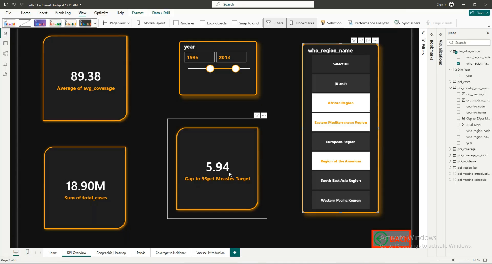
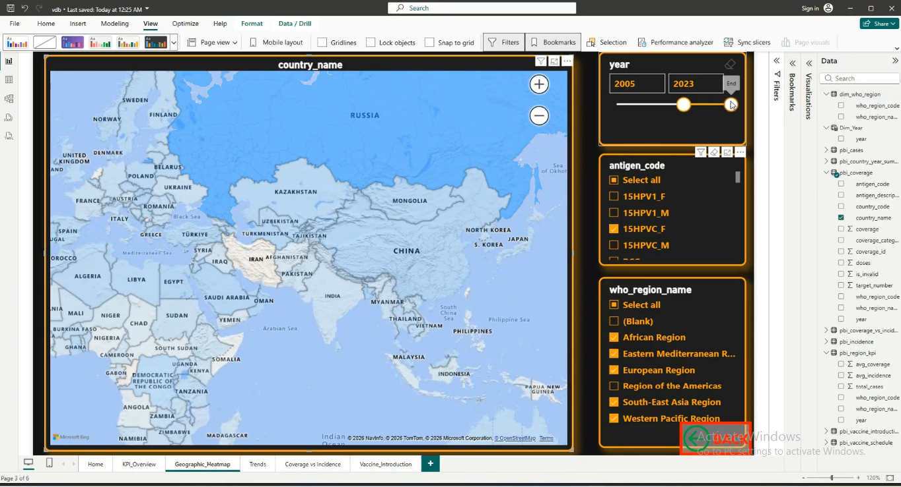
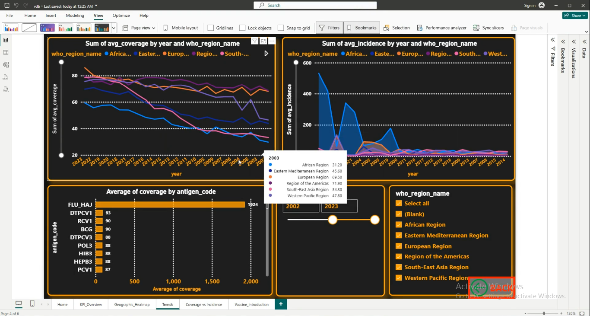
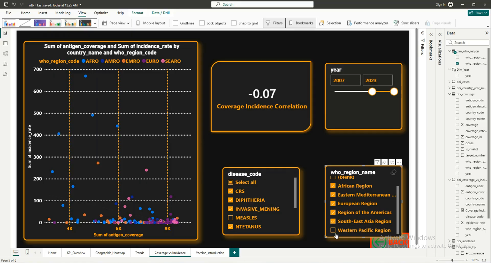
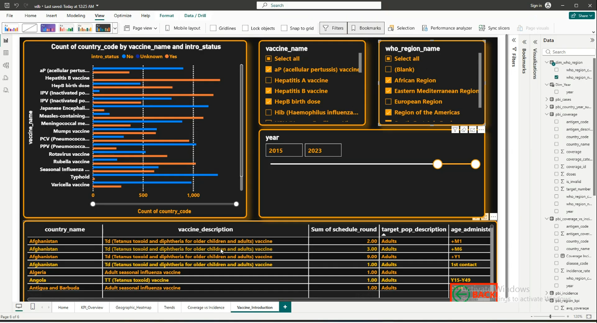
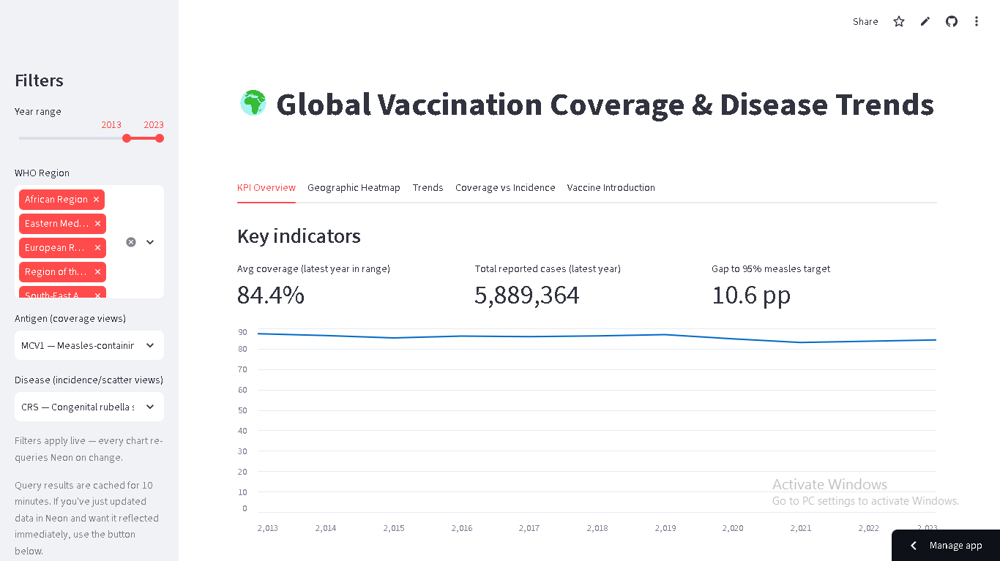
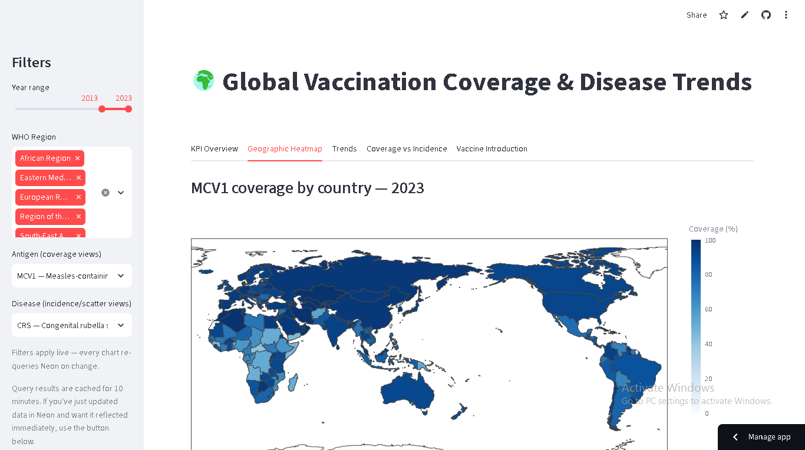
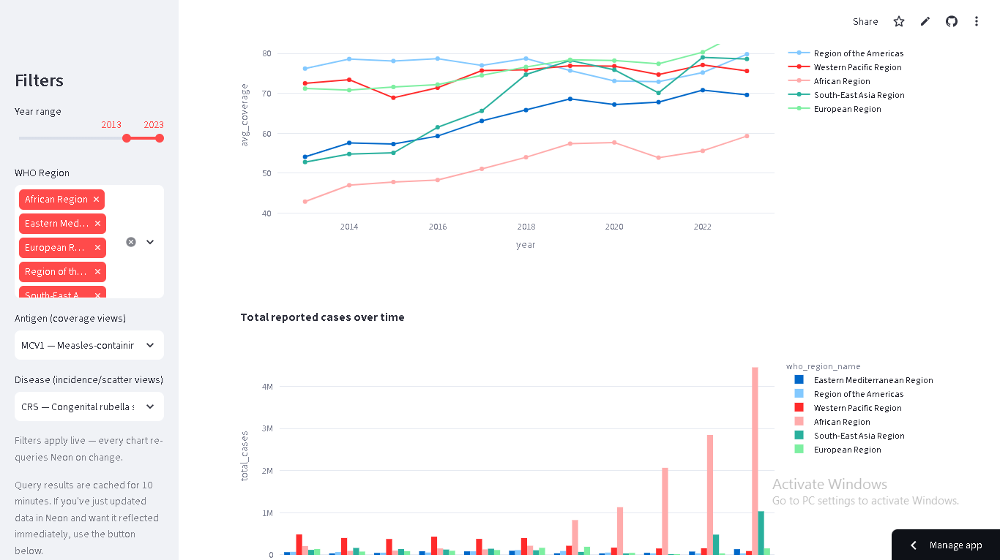
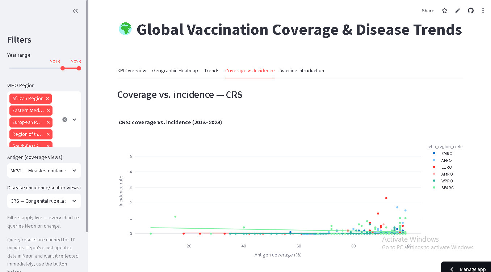
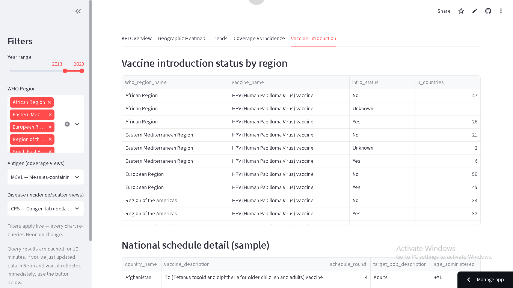

# Global Vaccination Data Analysis & Dashboard

Analyze global vaccination data to understand trends in vaccination coverage,
disease incidence, and effectiveness — cleaned and structured into a
normalized SQL database, migrated to a live cloud PostgreSQL instance, and
visualized through two independent interactive dashboards (Power BI and
Streamlit), both querying the same live database.

## Quick Links

| | |
|---|---|
| 📊 **Live Streamlit Dashboard** | [vaccinationeda-app1.streamlit.app](https://vaccinationeda-app1.streamlit.app/) |
| 📁 **Raw Dataset (Google Drive)** | [WHO vaccination data — CSV/Excel source files](https://drive.google.com/drive/folders/1YQ6mNrZCrlEeBP4GH3VnLBNXb7OBD4tf) |
| 🗄️ **Live Database** | PostgreSQL on [Neon](https://neon.tech) — connected directly by both dashboards and by `Migration_n_Query.ipynb` |
| 📄 **Full Project Report** | `Vaccination_Project_Report.docx` (in this repo) — 45-page write-up covering every stage below, all 25 SQL questions in full, and every chart/dashboard screenshot |
| 📈 **Power BI Dashboard** | `.pbix` file in this repo (see screenshots below) — not published to Power BI Service, so opening it requires Power BI Desktop |

## Pipeline overview

```
Raw WHO datasets (Google Drive — see link above)
      │
      ▼
Vaccination_EDA.ipynb       → cleans, validates, and exports 7 cleaned CSVs;
                               15 exploratory charts with insights
      │
      ▼
SQL.ipynb                   → builds a normalized star-schema SQL database
                               (SQLite), answers every analysis question in
                               the project brief (Easy/Medium/Scenario-based,
                               ~30 questions total), generates the ER diagram,
                               and exports Power BI–ready flattened tables
      │
      ▼
Migration_n_Query.ipynb     → migrates the SQLite database to a live,
                               always-on PostgreSQL database on Neon, with a
                               password-gated interactive query tool
      │
      ▼
      ├──► Power BI Dashboard   → 5 pages + Home navigation, connected live
      │                           to Neon via Power BI's PostgreSQL connector
      │
      └──► Streamlit Dashboard  → 5 tabs, deployed on Streamlit Community
                                   Cloud, connected live to Neon via SQLAlchemy
```

## Current Status

- ✅ Data cleaning & EDA complete (7 cleaned CSVs, 15 charts)
- ✅ SQL database designed, built, and fully documented (star schema + ER diagram)
- ✅ All ~30 project-brief questions answered in SQL, including explicit "not answerable with this dataset" notes where the data genuinely can't answer something
- ✅ Migrated to a live PostgreSQL database on Neon (free tier, no trimming needed)
- ✅ Interactive password-gated query tool for ad-hoc live querying
- ✅ Power BI dashboard built — 5 pages + Home navigation, all connected live to Neon
- ✅ Streamlit dashboard built and **deployed live** — see link above
- ✅ Full 45-page project report written, covering every stage with screenshots and the complete SQL Q&A appendix

## Repository Structure

```
.
├── README.md                        # This file
├── Vaccination_Project_Report.docx   # Full 45-page project report
├── Vaccination_EDA.ipynb             # Data cleaning & exploratory analysis
├── SQL.ipynb                         # SQLite star-schema DB + full SQL analysis + ER diagram
├── Migration_n_Query.ipynb           # Neon PostgreSQL migration + interactive query tool
├── vaccination_er.png                # Exported entity-relationship diagram
├── <dashboard>.pbix                  # Power BI dashboard file
├── screenshots/                      # Dashboard screenshots (see below)
└── streamlit_app/
    ├── app.py                        # Streamlit dashboard source code
    ├── requirements.txt
    ├── .gitignore
    └── .streamlit/
        └── secrets.toml.example      # Template only — real secrets live in
                                         Streamlit Cloud's own secrets manager
```

## Data Sources

Five datasets sourced from the WHO Immunization Data Portal (raw CSV/Excel
files available at the [Google Drive link above](https://drive.google.com/drive/folders/1YQ6mNrZCrlEeBP4GH3VnLBNXb7OBD4tf)),
covering 1980–2023:

- **Vaccination coverage** — by country, year, antigen, and reporting category (ADMIN/OFFICIAL/WUENIC/HPV/PAB)
- **Incidence rate** and **reported cases** — by country, year, and disease
- **Vaccine introduction** — whether/when each country added a vaccine to its national program
- **Vaccine schedule** — national dosing schedules, target populations, age administered

## Database Schema

A normalized star schema — dimension tables (`dim_country`, `dim_who_region`,
`dim_antigen`, `dim_disease`, `dim_vaccine`) and fact tables (`fact_coverage`,
`fact_incidence`, `fact_cases`, `fact_vaccine_introduction`,
`fact_vaccine_schedule`, plus a pre-aggregated `agg_country_year_summary`),
connected through two reference bridge tables mapping antigens/vaccines to
the diseases they protect against. Full schema table and ER diagram are in
`SQL.ipynb` and reproduced in the project report.

## Power BI Dashboard

Connects live to the Neon PostgreSQL database via Power BI's native
PostgreSQL connector. Five pages plus a Home navigation page, with
synced year/region slicers across pages.

| Home | KPI Overview |
|---|---|
|  |  |

| Geographic Heatmap | Trends |
|---|---|
|  |  |

| Coverage vs Incidence | Vaccine Introduction |
|---|---|
|  |  |

## Streamlit Dashboard

**Live at: [vaccinationeda-app0.streamlit.app](https://vaccinationeda-app0.streamlit.app/)**

Deployed on Streamlit Community Cloud, connected live to the same Neon
database via SQLAlchemy — every chart re-queries Neon on every filter
change, with a manual refresh button to bypass the 10-minute query cache
when needed.

| KPI Overview | Geographic Heatmap |
|---|---|
|  |  |

| Trends | Coverage vs Incidence |
|---|---|
|  |  |

| Vaccine Introduction |
|---|
|  |

## Tech Stack

- **Python** — pandas, numpy
- **SQLite** — initial normalized database, built in Colab
- **PostgreSQL (Neon)** — live, always-on production database
- **SQLAlchemy** / **psycopg2** — database connectivity
- **Streamlit** + **Plotly** — interactive dashboard and visualizations
- **Graphviz** — ER diagram generation
- **Power BI Desktop** — connected via its native PostgreSQL connector
- **Jupyter/Colab notebooks** — the entire pipeline, no local environment required

## Data Limitations

Several questions in the original project brief ask about dimensions this
dataset does not contain. Rather than fabricate an answer, `SQL.ipynb` (and
the full project report) states these gaps explicitly wherever they come up:

- **No demographic breakdown** — no gender, education level, or
  socioeconomic/income data *within* a country (the closest available
  proxy is a *cross-country* World Bank income-group rollup).
- **No geographic granularity below country level** — no urban/rural
  split, no population density.
- **No sub-annual granularity** — all figures are annual; no month/date
  field exists to examine seasonal patterns.
- **No delivery-strategy field** — no way to compare door-to-door vs.
  centralized-clinic vaccination approaches.
- **No influenza case/incidence data** — vaccine *introduction* status for
  seasonal influenza is tracked, but no influenza case counts exist in the
  disease-level tables.

Also worth knowing: the antigen↔disease and vaccine↔disease mapping tables
are built from public WHO/CDC vaccine-preventable-disease knowledge, not
inferred from the data itself — not every antigen or disease in the dataset
has a mapped counterpart.

## Deploying / Running This Project Yourself

1. Download the raw data from the [Google Drive link](https://drive.google.com/drive/folders/1YQ6mNrZCrlEeBP4GH3VnLBNXb7OBD4tf) and run `Vaccination_EDA.ipynb` to produce the cleaned CSVs.
2. Run `SQL.ipynb` to build the SQLite database and reproduce the full analysis.
3. Set up a free Neon PostgreSQL project, then run `Migration_n_Query.ipynb` to migrate the database live.
4. For the Streamlit app: push `streamlit_app/` to a GitHub repo, deploy on [share.streamlit.io](https://share.streamlit.io), and add your Neon connection string under the app's Settings → Secrets.
5. For Power BI: open the `.pbix` file in Power BI Desktop, or connect fresh via Get Data → PostgreSQL database using your own Neon credentials.

## License

*(Add your license here — e.g. MIT, or leave as coursework/academic use only.)*

## Acknowledgments

Built on WHO immunization data as part of an applied data analysis and
visualization project covering SQL database design, normalization, cloud
database migration, and interactive dashboard development.
